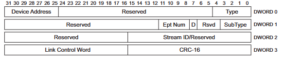
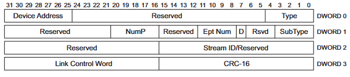

- [_overview_](#overview)
- [_packet_](#packet)
  - [_usb 2.x_](#usb-2x)
    - [_token packet_](#token-packet)
    - [_data packet_](#data-packet)
    - [_handshake packet_](#handshake-packet)
  - [_usb 3.x_](#usb-3x)
    - [_link management packet_](#link-management-packet)
    - [_data packet_](#data-packet-1)
    - [_transaction packet_](#transaction-packet)
    - [_isochronous timestamp packet_](#isochronous-timestamp-packet)
- [_transaction_](#transaction)
  - [_usb 2.x_](#usb-2x-1)
    - [_setup transaction_](#setup-transaction)
    - [_out transaction_](#out-transaction)
    - [_in transaction_](#in-transaction)
    - [_nak out transaction_](#nak-out-transaction)
    - [_nak in transaction_](#nak-in-transaction)
  - [_usb 3.x_](#usb-3x-1)
    - [_setup transaction_](#setup-transaction-1)
    - [_out transaction_](#out-transaction-1)
    - [_in transaction_](#in-transaction-1)
    - [_nak out transaction_](#nak-out-transaction-1)
    - [_nak in transaction_](#nak-in-transaction-1)
- [_transfer_](#transfer)
  - [_bulk transfer_](#bulk-transfer)
  - [_control transfer_](#control-transfer)
    - [_set stage_](#set-stage)
    - [_data stage_](#data-stage)
    - [_status stage_](#status-stage)
  - [_interrupt transfer_](#interrupt-transfer)
  - [_isochronous transfer_](#isochronous-transfer)
- [_flow_](#flow)

# _overview_

_usb_ 协议（以下简称 _usb_）不同版本的细节是不同的，比如：_usb 2.x_ 是 _480Mb/s_ 而 _usb 3.x_ 是 _5Gb/s_；_usb 2.x_ 和 _usb 3.x_ 的 _packet_ 的格式是不同的...，但是框架都是相同的，比如：所有传输都必须是由 _host_ 主动发起的，_device_ 是无法主动发起任何操作的；_transaction_ 是由 _packet_ 组成的；_transfer_ 是由 _transaction_ 组成的...。当一个 _device_ 枚举时，_host_ 首先会给 _the specific device_ 分配 _device address_，然后通过相关的 _descriptor_ 得到 _endpoints_ 信息，最后通过 _device address_ 和 _endpoint_ 来与 _device_ 通信。

# _packet_

_packet_ 是 _usb_ 中的 **_原子单位_**。

## _usb 2.x_

### _token packet_ 

_setup packet_  
_in packet_  
_out packet_

### _data packet_

_data0 packet_  
_data1 packet_  
_data2 packet_  
_mdata packet_  

### _handshake packet_

_ack packet_  
_nak packet_  
_stall packet_  
_nyet packet_  
_err packet_  

## _usb 3.x_

### _link management packet_

_set link function packet_  
_u2 inactivity timeout packet_  
_vendor device test packet_  
_port capability packet_  
_port configuration packet_  
_port configuration response packet_  

### _data packet_

### _transaction packet_

_ack transaction packet_  

_not ready transaction packet_  

_endpoint ready transaction pack_  
 

_status transaction packet_  

_stall transaction packet_  

...

### _isochronous timestamp packet_

# _transaction_

_transaction_ 是 _usb_ 中的 **_逻辑单位_**，在一些 _chip_ 中，都是以 _transaction_ 为单位处理的，比如：一个 _transaction_ 一个中断，一定要注意这句话，_**一个 _transaction_ 一个中断**_，掌握了这句话，所有的 _mcu_ 和 _cpu_ 的 _usb_ 都可以掌握。在一个 _transaction_ 中只能有一个 _data packet_，不能有多个 _data packet_。

## _usb 2.x_

### _setup transaction_  

_the host send the setup packet to the device_    
_the host send the data packet to the device_  
_the device send the ack packet to the host_

### _out transaction_ 

_the host send the out packet to the device_  
_the host send the data packet to the device_  
_the device send the ack packet to the host_  

### _in transaction_

_the host send the in packet to the device_  
_the device send the data packet to the host_  
_the host send the ack packet to the device_

### _nak out transaction_

_the host send the out packet to the device_  
_the host send the data packet to the device_

### _nak in transaction_

_the host send the in packet to the device_  
_the device send the data packet to the host_ 

## _usb 3.x_

### _setup transaction_  

_the host send the data packet to the device_  
_the device send the ack transaction packet to the host_

### _out transaction_ 

_the host send the data packet to the device_  
_the device send the ack transaction packet to the host_

_the host send the data packet to the device_  
_the host send the data packet to the device_  
_the host send the data packet to the device_  
...  
_the device send the ack transaction packet to the host_  
_the device send the ack transaction packet to the host_  
_the device send the ack transaction packet to the host_  
...

### _in transaction_

_the host send the ack transaction packet to the device_（此时相当于 _in packet_，_host_ 通知 _device_ 所需要的 _data packet_ 的个数）  
_the device send the data packet to the host_（此时相当于 _ack packet_ 和 _in packet_，_host_ 通知 _device_ 所需要的 _data packet_ 的个数）  

_the host send the ack transaction packet to the device_  
_the device send the data packet to the host_  
_the device send the data packet to the host_  
_the device send the data packet to the host_  
...
_the host send the ack transaction packet to the device_  
_the host send the ack transaction packet to the device_  

### _nak out transaction_

_the host send the data packet to the device_

### _nak in transaction_

_the host send the ack transaction packet to the device_（此时相当于 _in packet_，_host_ 通知 _device_ 所需要的 _data packet_ 的个数）  

_the device send the data packet to the host_  
_the device send the data packet to the host_  
_the device send the data packet to the host_ 

# _transfer_  

一个 _(micro)frame_ 内，_interrupt transfer_ 和 _isochronous transfer_ 最多可以使用 _usb_ 的 _80%_ 的带宽；_control transfer_ 最少可以使用 _20%_ 的带宽，因为还可以使用 _interrupt transfer_ 和 _isochronous transfer_ 未使用的带宽；_bulk transfer_ 可以使用其他 _3_ 个 _transfer_ 未使用的带宽。一个 _transfer_ 所包含的 _transactions_ 可以分布在不同的 _(micro)frame_ 中，并且一个 _(micro)frame_ 可以完成的最大 _transfer_ 的数量无法计算。

## _bulk transfer_  

_out transactions_ 或 _in transactions_

## _control transfer_

### _set stage_

_setup transaction_

### _data stage_

_out transactions_ 或  _in transactions_

### _status stage_ 

_in transaction_ 或  _out transaction_

## _interrupt transfer_

间隔进行 _out transactions_ 或 _in transactions_

## _isochronous transfer_

间隔进行 _nak out transactions_ 或 _nak in transactions_

# _flow_

* _A device connects the host_。
* _The host reset the device_。
* _The host gets the part of the device descriptor for the device via the device address 0 and the endpoint 0_。
* _The host reset the device again_。
* _The host sets a device address for the device via a control transfer_。
* _The host gets the all of a device descriptor for the device via the device address and endpoint 0_。
*  _The host gets the config descriptor, the interface descriptor and the endpoint descriptor for the device via the device address and the endpoint 0_。
*  _Now the host has known the number of the configurations, the interfaces and thn endpoints_。
*  _The host can access the device via the device address and the endpoints_。
  
