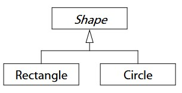
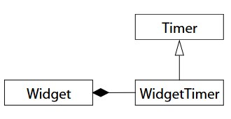

- [_Item 1_ 将 _C++_ 视为语言联邦](#item-1-将-c-视为语言联邦)
  - [_C++_ 由 _4_ 部分组成](#c-由-4-部分组成)
  - [在 _C_ 中，_pass-by-value_ 比 _pass-by-reference_ 高效](#在-c-中pass-by-value-比-pass-by-reference-高效)
  - [在 _object-oriented C++_ 和 _template C++_ 中，_pass-by-reference-to-const_ 比 _pass-by-value_ 高效](#在-object-oriented-c-和-template-c-中pass-by-reference-to-const-比-pass-by-value-高效)
  - [在 _STL_ 中，_pass-by-value_ 比 _pass-by-reference_ 高效](#在-stl-中pass-by-value-比-pass-by-reference-高效)
- [_Item 2_ 首选 _const_、_enum_ 和 _inline_ 而不是 _#define_](#item-2-首选-constenum-和-inline-而不是-define)
  - [_const_ 变量和 _enumerator_ 可以被调试](#const-变量和-enumerator-可以被调试)
  - [_const_ 变量和 _enumerator_ 所产生的目标代码较小](#const-变量和-enumerator-所产生的目标代码较小)
  - [_const_ 变量和 _enumerator_ 的作用域可以被限制](#const-变量和-enumerator-的作用域可以被限制)
  - [_inline_ 函数可以避免 _#define_ **_函数_** 的 _bug_](#inline-函数可以避免-define-函数-的-bug)
- [_Item 3_ 只要有可能就使用 _const_](#item-3-只要有可能就使用-const)
  - [_const iterator_ 和 _const\_iterator_](#const-iterator-和-const_iterator)
  - [_const_ 用在函数返回类型上可以避免函数的返回值被意外修改](#const-用在函数返回类型上可以避免函数的返回值被意外修改)
  - [_const_ 用在函数形参上可以 _pass-by-reference-to-const_](#const-用在函数形参上可以-pass-by-reference-to-const)
  - [_const_ 用在成员函数上使得可以去操作 _const_ 对象，并且可以明确表明本函数不会改变所对应的对象的内容](#const-用在成员函数上使得可以去操作-const-对象并且可以明确表明本函数不会改变所对应的对象的内容)
  - [_const_ 函数和 _non-const_ 函数是函数重载，_non-const_ 函数调用 _const_ 函数可以避免代码重复](#const-函数和-non-const-函数是函数重载non-const-函数调用-const-函数可以避免代码重复)
- [_Item 4_ 确保对象在被使用前先被初始化](#item-4-确保对象在被使用前先被初始化)
  - [确保对象在被使用前先被初始化，使用成员初始化列表法，而不是构造赋值法](#确保对象在被使用前先被初始化使用成员初始化列表法而不是构造赋值法)
  - [_local static_ 和 _non-local static_ 对象](#local-static-和-non-local-static-对象)
  - [不同的 _translation unit_ 中所定义的 _non-local static_ 对象的初始化顺序是没有被定义的](#不同的-translation-unit-中所定义的-non-local-static-对象的初始化顺序是没有被定义的)
- [_Item 5_ 了解 _C++_ 会悄悄地写和调用哪些函数](#item-5-了解-c-会悄悄地写和调用哪些函数)
  - [可以被生成的函数](#可以被生成的函数)
  - [被生成的函数都是 _public_、_inline_ 和 _non-virual_ 的](#被生成的函数都是-publicinline-和-non-virual-的)
- [_Item 6_ 显式拒绝你不想要的编译器所生成的函数](#item-6-显式拒绝你不想要的编译器所生成的函数)
  - [禁止生成 _default constructor_ 的方法](#禁止生成-default-constructor-的方法)
  - [禁止生成析构函数的方法](#禁止生成析构函数的方法)
  - [禁止生成 _copy constructor_ 和 _copy assignment operator_ 的方法](#禁止生成-copy-constructor-和-copy-assignment-operator-的方法)
  - [禁止 _copy constructor_ 和 _copy assignment operator_ 被调用的方法](#禁止-copy-constructor-和-copy-assignment-operator-被调用的方法)
- [_Item 7_ 在 _polymorphic base class_ 中声明析构函数为 _virtual_](#item-7-在-polymorphic-base-class-中声明析构函数为-virtual)
  - [会被继承的 _base class_ 的析构函数必须要为 _virtual_](#会被继承的-base-class-的析构函数必须要为-virtual)
  - [析构函数不是 _virtual_ 的类不能被继承来做为 _base class_](#析构函数不是-virtual-的类不能被继承来做为-base-class)
- [_Item 8_ 阻止异常离开析构函数](#item-8-阻止异常离开析构函数)
  - [允许异常传离开析构函数会导致 _undefined behavior_](#允许异常传离开析构函数会导致-undefined-behavior)
  - [阻止异常离开析构函数](#阻止异常离开析构函数)
- [_Item 9_ 永远不在构造和析构期间调用 _virtual function_](#item-9-永远不在构造和析构期间调用-virtual-function)
  - [在 _base class_ 构造和析构期间，_virtual function_ 没有 _virtual_ 特性](#在-base-class-构造和析构期间virtual-function-没有-virtual-特性)
  - [禁止在构造函数和析构函数中调用 _virtual function_](#禁止在构造函数和析构函数中调用-virtual-function)
- [_Item 10_ 让 _operator=_ 返回 _reference to \*this_](#item-10-让-operator-返回-reference-to-this)
  - [让 _operator=_ 返回 _reference to \*this_ 可以支持链式访问](#让-operator-返回-reference-to-this-可以支持链式访问)
- [_Item 11_ 在 _operator=_ 中处理自我赋值](#item-11-在-operator-中处理自我赋值)
  - [自我赋值和潜在的自我赋值](#自我赋值和潜在的自我赋值)
  - [在 _operator=_ 中处理自我赋值](#在-operator-中处理自我赋值)
- [_Item 12_ 拷贝对象的所有部分](#item-12-拷贝对象的所有部分)
  - [_derived class object_ = _derived class object_](#derived-class-object--derived-class-object)
- [_Item 13_ 使用对象去管理资源](#item-13-使用对象去管理资源)
  - [资源不只是内存](#资源不只是内存)
  - [_RAII_](#raii)
  - [使用 _RAII_ 类的对象来管理资源，消除客户管理资源的责任](#使用-raii-类的对象来管理资源消除客户管理资源的责任)
  - [_std::auto\_ptr_ 和 _tr1::shared\_ptr_ 不能用于管理动态分配的数组](#stdauto_ptr-和-tr1shared_ptr-不能用于管理动态分配的数组)
- [_Item 14_ 仔细思考资源管理类中的拷贝行为](#item-14-仔细思考资源管理类中的拷贝行为)
  - [一般禁止资源管理类的拷贝行为](#一般禁止资源管理类的拷贝行为)
- [_Item 15_ 在资源管理类中提供对原始资源的访问](#item-15-在资源管理类中提供对原始资源的访问)
  - [资源管理类都应该提供获取其所管理的资源的方法](#资源管理类都应该提供获取其所管理的资源的方法)
- [_Item 16_ 使用相同形式的 _new_ 和 _delete_](#item-16-使用相同形式的-new-和-delete)
  - [_new_ 对应于 _delete_，_new \[\]_ 对应于 _delete \[\]_](#new-对应于-deletenew--对应于-delete-)
- [_Item 17_ 将 _new_ 所创建的对象放在独立语句中](#item-17-将-new-所创建的对象放在独立语句中)
  - [将 _new_ 所创建的对象放在独立语句中可以避免资源泄露](#将-new-所创建的对象放在独立语句中可以避免资源泄露)
- [_Item 18_ 使接口容易被正确使用，不容易被错误使用](#item-18-使接口容易被正确使用不容易被错误使用)
  - [让接口与内建类型的行为兼容](#让接口与内建类型的行为兼容)
  - [_cross-DLL_ 问题](#cross-dll-问题)
- [_Item 19_ 将类设计视为类型设计](#item-19-将类设计视为类型设计)
  - [如何设计类的创建和销毁](#如何设计类的创建和销毁)
  - [如何设计类的赋值](#如何设计类的赋值)
  - [如何设计类的成员](#如何设计类的成员)
  - [类是否需要继承](#类是否需要继承)
  - [类是否可以被继承](#类是否可以被继承)
  - [如何设计类的转换函数](#如何设计类的转换函数)
  - [如何设计类的 _operator_](#如何设计类的-operator)
  - [如何设计类的异常安全](#如何设计类的异常安全)
  - [是否需要设计为类模板](#是否需要设计为类模板)
- [_Item 20_ 首选 _pass-by-reference-to-const_ 而不是 _pass-by-value_](#item-20-首选-pass-by-reference-to-const-而不是-pass-by-value)
  - [首选 _pass-by-reference-to-const_ 而不是 _pass-by-value_ 的原因](#首选-pass-by-reference-to-const-而不是-pass-by-value-的原因)
- [_Item 21_ 当返回对象时，不要尝试返回引用](#item-21-当返回对象时不要尝试返回引用)
  - [当 _local static_ 对象对应有多个引用时，禁止返回指向着这个 _local static_ 对象的引用](#当-local-static-对象对应有多个引用时禁止返回指向着这个-local-static-对象的引用)
  - [引用只是一个已经存在的对象的名字而已](#引用只是一个已经存在的对象的名字而已)
- [_Item 22_ 声明数据成员为 _private_](#item-22-声明数据成员为-private)
- [_Item 23_ 首选 _non-member_ _non-friend_ 函数而不是成员函数](#item-23-首选-non-member-non-friend-函数而不是成员函数)
- [_Item 24_ 当类型转换会被应用到函数的所有形参上时，需要声明这个函数为 _non-member_ 函数](#item-24-当类型转换会被应用到函数的所有形参上时需要声明这个函数为-non-member-函数)
  - [当隐式类型转换会被应用到函数的所有形参上时，特别是 _this_ 上时，需要声明这个函数为 _non-member_ 函数](#当隐式类型转换会被应用到函数的所有形参上时特别是-this-上时需要声明这个函数为-non-member-函数)
  - [只要有可能就在构造函数中使用 _explicit_](#只要有可能就在构造函数中使用-explicit)
- [_Item 25_ 考虑支持 _non-throwing_ _swap_](#item-25-考虑支持-non-throwing-swap)
  - [允许对标准库中函数模板进行特化，禁止对标准库中函数模板进行重载](#允许对标准库中函数模板进行特化禁止对标准库中函数模板进行重载)
  - [对标准库中的函数模板进行 _替换_ 的方法](#对标准库中的函数模板进行-替换-的方法)
- [_Item 26_ 只要有可能就推迟变量的定义](#item-26-只要有可能就推迟变量的定义)
- [_Item 27_ 尽量少转换](#item-27-尽量少转换)
  - [转换的本质](#转换的本质)
  - [首选 _C++-style_ 转换而不是 _C-style_ 转换](#首选-c-style-转换而不是-c-style-转换)
  - [尽量少转换](#尽量少转换)
- [_Item 28_ 避免返回指向对象内部成员的 _handle_](#item-28-避免返回指向对象内部成员的-handle)
  - [避免返回指向对象内部成员的引用、指针或 _iterator_](#避免返回指向对象内部成员的引用指针或-iterator)
- [_Item 29_ 致力于异常安全代码](#item-29-致力于异常安全代码)
- [_Item 30_ 理解 _inline_](#item-30-理解-inline)
  - [_inline_ 函数可能会导致目标代码变小或变大](#inline-函数可能会导致目标代码变小或变大)
  - [_inline_ 只是申请不是命令](#inline-只是申请不是命令)
- [_Item 31_ 尽量降低文件之间的编译依赖](#item-31-尽量降低文件之间的编译依赖)
  - [通过尽量依赖于声明而不是定义来降低文件之间的编译依赖](#通过尽量依赖于声明而不是定义来降低文件之间的编译依赖)
- [_Item 32_ 确保 _public_ 继承模拟 _is-a_](#item-32-确保-public-继承模拟-is-a)
  - [_public_ 继承意味着 _is-a_](#public-继承意味着-is-a)
- [_Item 33_ 避免覆盖所继承而来的名称](#item-33-避免覆盖所继承而来的名称)
  - [覆盖所继承而来的名称会破坏 _is-a_ 关系](#覆盖所继承而来的名称会破坏-is-a-关系)
- [_Item 34_ 区分接口继承和实现继承](#item-34-区分接口继承和实现继承)
  - [_pure virtual function_、_impure virtual function_ 和 _non-virtual function_ 的作用](#pure-virtual-functionimpure-virtual-function-和-non-virtual-function-的作用)
- [_Item 35_ 考虑 _virtual function_ 的替代方法](#item-35-考虑-virtual-function-的替代方法)
  - [可以使用设计模式 _template_ 和 _strategy_ 来代替 _virtual function_](#可以使用设计模式-template-和-strategy-来代替-virtual-function)
- [_Item 36_ 永远不重新定义所继承而来的 _non-virtual function_](#item-36-永远不重新定义所继承而来的-non-virtual-function)
  - [重新定义所继承而来的 _non-virtual function_ 相当于覆盖](#重新定义所继承而来的-non-virtual-function-相当于覆盖)
- [_Item 37_ 永远不重新定义函数所继承而来的默认形参值](#item-37-永远不重新定义函数所继承而来的默认形参值)
  - [静态类型和动态类型](#静态类型和动态类型)
  - [永远不重新定义函数所继承而来的默认形参值](#永远不重新定义函数所继承而来的默认形参值)
- [_Item 38_ 通过组合模拟 _has-a_ 或 _is-implemented-in-terms-of_](#item-38-通过组合模拟-has-a-或-is-implemented-in-terms-of)
  - [_has-a_ 和 _is-implemented-in-terms-of_](#has-a-和-is-implemented-in-terms-of)
  - [组合可以实现 _has-a_ 和 _is-implemented-in-terms-of_](#组合可以实现-has-a-和-is-implemented-in-terms-of)
- [_Item 39_ 明智而审慎地使用 _private_ 继承](#item-39-明智而审慎地使用-private-继承)
  - [_private_ 继承意味着 _is-implemented-in-terms-of_](#private-继承意味着-is-implemented-in-terms-of)
  - [_private_ 继承会导致不希望被继承到 _derived class_ 中的 _virtual function_ 被继承到 _derived class_ 中](#private-继承会导致不希望被继承到-derived-class-中的-virtual-function-被继承到-derived-class-中)
  - [可以通过组合来实现 _private_ 继承](#可以通过组合来实现-private-继承)
  - [_private_ 继承的使用场景](#private-继承的使用场景)
- [_Item 40_ 明智而审慎地使用多继承](#item-40-明智而审慎地使用多继承)
  - [多继承复杂且成本大](#多继承复杂且成本大)
- [_Item 41_ 了解隐式接口和 _compile-time_ 多态](#item-41-了解隐式接口和-compile-time-多态)
  - [模板的隐式接口](#模板的隐式接口)
  - [模板的 _compile-time_ 多态](#模板的-compile-time-多态)
- [_Item 42_ 了解 _typename_ 的双重含义](#item-42-了解-typename-的双重含义)
  - [_depend name_ 和 _nested depend name_](#depend-name-和-nested-depend-name)
  - [_typename_ 被用来声明模板类型形参](#typename-被用来声明模板类型形参)
  - [_typename_ 被用来声明 _nested depend name_ 为类型](#typename-被用来声明-nested-depend-name-为类型)
- [_Item 43_ 了解如何访问模板化的 _base class_ 中的名称](#item-43-了解如何访问模板化的-base-class-中的名称)
  - [_derived class_ 模板拒绝去模板化的 _base class_ 中查找所继承而来的名称](#derived-class-模板拒绝去模板化的-base-class-中查找所继承而来的名称)
  - [强迫 _derived class_ 模板去模板化的 _base class_ 中查找所继承而来的名称的方法](#强迫-derived-class-模板去模板化的-base-class-中查找所继承而来的名称的方法)
- [_Item 44_ 将与参数无关的代码从模板中提取出来](#item-44-将与参数无关的代码从模板中提取出来)
  - [将与参数无关的代码从模板中提取出来以避免重复](#将与参数无关的代码从模板中提取出来以避免重复)
- [_Item 45_ 使用成员函数模板去接受所有的兼容类型](#item-45-使用成员函数模板去接受所有的兼容类型)
  - [同一模板的不同实例化之间是没有任何内在的关系的](#同一模板的不同实例化之间是没有任何内在的关系的)
  - [使用成员函数模板去接受所有的兼容类型](#使用成员函数模板去接受所有的兼容类型)
  - [成员函数模板并不阻止那些可以被生成的函数被生成](#成员函数模板并不阻止那些可以被生成的函数被生成)
- [_Item 46_ 当需要类型转换时，在模板内定义 _non-member_ 函数](#item-46-当需要类型转换时在模板内定义-non-member-函数)
  - [隐式类型转换函数在模板实参推导期间是永远不会被考虑的](#隐式类型转换函数在模板实参推导期间是永远不会被考虑的)
  - [当隐式类型转换会被应用到函数的所有形参上，特别是 _this_ 上且这个函数依赖于类模板时，需要声明这个函数为友元函数且在模板类中进行实现](#当隐式类型转换会被应用到函数的所有形参上特别是-this-上且这个函数依赖于类模板时需要声明这个函数为友元函数且在模板类中进行实现)
- [_Item 47_ 对于类型的信息使用 _trait_ 类](#item-47-对于类型的信息使用-trait-类)
- [_Item 48_ 了解模板元编程 _TMP_](#item-48-了解模板元编程-tmp)
  - [_TMP_ 是 _Turing-complete_](#tmp-是-turing-complete)
  - [_TMP_ 可以将工作从 _runtime_ 转移至 _compile-time_](#tmp-可以将工作从-runtime-转移至-compile-time)
- [_Item 49_ 了解 _new-handler_ 的行为](#item-49-了解-new-handler-的行为)
  - [当 _operator new_ 无法满足内存分配需求时，会调用 _new-handler_](#当-operator-new-无法满足内存分配需求时会调用-new-handler)
  - [如何设计 _new-handler_](#如何设计-new-handler)
  - [使用 _CRTP_ 来为每个类设置 _new-handler_](#使用-crtp-来为每个类设置-new-handler)
  - [禁止使用 _nothrow new_](#禁止使用-nothrow-new)
- [_Item 50_ 了解何时替换 _new_ 和 _delete_ 是有意义的](#item-50-了解何时替换-new-和-delete-是有意义的)
  - [_custom operator new_ 和 _custom operator delete_ 的作用](#custom-operator-new-和-custom-operator-delete-的作用)
- [_Item 51_ 当写 _new_ 和 _delete_ 时，遵循常规](#item-51-当写-new-和-delete-时遵循常规)
  - [_operator new_ 的实现方法](#operator-new-的实现方法)
  - [_custom operator new_ 和 _custom operator delete_ 需要处理非期望大小的内存块](#custom-operator-new-和-custom-operator-delete-需要处理非期望大小的内存块)
  - [_operator new\[\]_ 中的元素个数 _!=_ _(bytes requested)/sizeof(class)_](#operator-new-中的元素个数--bytes-requestedsizeofclass)
- [_Item 52_ 如果写了 _placement new_ 的话，那么也必须要写 _placement delete_](#item-52-如果写了-placement-new-的话那么也必须要写-placement-delete)
  - [_normal operator new_ 和 _normal operator delete_](#normal-operator-new-和-normal-operator-delete)
  - [_placement operator new_ 和 _placement operator delete_](#placement-operator-new-和-placement-operator-delete)
  - [如果写了 _placement operator new_ 的话，那么也必须要写 _placement operator delete_](#如果写了-placement-operator-new-的话那么也必须要写-placement-operator-delete)
  - [调用 _delete_ 只会调用 _normal operator delete_](#调用-delete-只会调用-normal-operator-delete)
  - [类中调用 _global operator new_ 和 _global operator delete_](#类中调用-global-operator-new-和-global-operator-delete)
- [_Item 53_ 注意编译器警告](#item-53-注意编译器警告)
- [_Item 54_ 熟悉包含了 _TR1_ 的标准库](#item-54-熟悉包含了-tr1-的标准库)
- [_Item 55_ 熟悉 _Boost_](#item-55-熟悉-boost)


# _Item 1_ 将 _C++_ 视为语言联邦

## _C++_ 由 _4_ 部分组成

_C++_ 由以下 _4_ 部分组成：_C_、_object-Oriented C++_、_template C++_ 和 _STL_，每个部分都有各自的高效编程规则。

## 在 _C_ 中，_pass-by-value_ 比 _pass-by-reference_ 高效

在 _C_ 中，_pass-by-value_ 比 _pass-by-reference_ 高效。

## 在 _object-oriented C++_ 和 _template C++_ 中，_pass-by-reference-to-const_ 比 _pass-by-value_ 高效

在 _object-Oriented C++_ 和 _template C++_ 中，_pass-by-reference-to-const_ 比 _pass-by-value_ 避免了副本的创建和销毁且可以避免切割问题。

## 在 _STL_ 中，_pass-by-value_ 比 _pass-by-reference_ 高效

在 _STL_ 中，_pass-by-value_ 比 _pass-by-reference_ 高效，因为 _STL_ 中的对象是在 _C_ 指针的基础上构造出来的。

# _Item 2_ 首选 _const_、_enum_ 和 _inline_ 而不是 _#define_

## _const_ 变量和 _enumerator_ 可以被调试

_const_ 变量和 _enumerator_ 可以被调试，而 _#define_ **_变量_** 不可以被调试。

## _const_ 变量和 _enumerator_ 所产生的目标代码较小

_const_ 变量和 _enumerator_ 所产生的目标代码比 _#define_ 变量所产生的目标代码要小。

## _const_ 变量和 _enumerator_ 的作用域可以被限制

_const_ 变量和  _enumerator_ 的作用域可以被限制，而 _#define_ **_变量_** 的作用域不可以被限制，比如：_const_ 变量的作用域可以被限制在一个类中、函数中或文件中。

## _inline_ 函数可以避免 _#define_ **_函数_** 的 _bug_

_#define_ 函数：

```C++
  // call f with the maximum of a and b
  #define CALL_WITH_MAX(a, b) f((a) > (b) ? (a) : (b))
```

```C++
  int a = 5, b = 0;
  
  CALL_WITH_MAX(++a, b);                          // a is incremented twice
  CALL_WITH_MAX(++a, b+10);                       // a is incremented once
```

_inline_ 函数：

```C++
  template<typename T>                            // because we don’t
  inline void callWithMax(const T& a, const T& b) // know what T is, we
  {                                               // pass by reference-to-
    f(a > b ? a : b);                             // const — see Item 20
  }
```

# _Item 3_ 只要有可能就使用 _const_ 

## _const iterator_ 和 _const_iterator_ 

* _const iterator_：_iterator_ 不可以被更改。
* _const_iterator_：_const_iterator_ 所指向的内容不可以被更改。

```C++
  std::vector<int> vec;
  ...
  const std::vector<int>::iterator iter =         // iter acts like a T* const
  vec.begin();
  *iter = 10;                                     // OK, changes what iter points to
  ++iter;                                         // error! iter is const

  std::vector<int>::const_iterator cIter =        // cIter acts like a const T*
  vec.begin();
  *cIter = 10;                                    // error! *cIter is const
  ++cIter;                                        // fine, changes cIter
```

## _const_ 用在函数返回类型上可以避免函数的返回值被意外修改

没有 _const_ 时：

```C++
  class Rational { ... };

  Rational operator*(const Rational& lhs, const Rational& rhs);
```

```C++
  Rational a, b, c;

  ...
  (a * b) = c;                          // invoke operator= on the
                                        // result of a*b!
```

```C++
  if (a * b = c) ...                    // oops, meant to do a comparison!
```

有 _const_ 时：

```C++
  class Rational { ... };

  const Rational operator*(const Rational& lhs, const Rational& rhs);
```

```C++
  Rational a, b, c;

  ...
  (a * b) = c;                          // error!
```

```C++
  if (a * b = c) ...                    // error!
```

_const_ 用在函数返回类型上可以避免函数的返回值被意外修改。

## _const_ 用在函数形参上可以 _pass-by-reference-to-const_

_const_ 用在函数形参上可以 _pass-by-reference-to-const_，_pass-by-reference-to-const_ 功能上等同于 _pass-by-value_，前者相比于后者效率高，并且可以避免切割问题。

## _const_ 用在成员函数上使得可以去操作 _const_ 对象，并且可以明确表明本函数不会改变所对应的对象的内容

_const_ 用在成员函数上使得可以去操作 _const_ 对象，因为只有 _const_ 对象才可以调用 _const_ 函数。_const_ 函数可以明确表明本函数不会改变所对应的对象的内容。

```C++
  class TextBlock {
  public:
    ...
    const char& operator[](std::size_t position) const      // operator[] for
    { return text[position]; }                              // const objects

    char& operator[](std::size_t position)                  // operator[] for
    { return text[position]; }                              // non-const objects
    
  private:
    std::string text;
  };
```

```C++
  TextBlock tb("Hello");
  std::cout << tb[0];                                       // calls non-const
                                                            // TextBlock::operator[]
  const TextBlock ctb("World");
  std::cout << ctb[0];                                      // calls const TextBlock::operator[]
```

## _const_ 函数和 _non-const_ 函数是函数重载，_non-const_ 函数调用 _const_ 函数可以避免代码重复

_const_ 函数和 _non-const_ 函数是函数重载，_non-const_ 函数调用 _const_ 函数可以避免代码重复，禁止 _const_ 函数来调用 _non-const_ 函数。

```C++
  class TextBlock {
  public:
    ...
    const char& operator[](std::size_t position) const      // same as before
    { 
      ...
      ...
      ...
      return text[position];
    }

    char& operator[](std::size_t position)                  // now just calls const op[]
    { 
      return
        const_cast<char&>(                                  // cast away const on
                                                            // op[]’s return type;
          static_cast<const TextBlock&>(*this)              // add const to *this’s type;
            [position]                                      // call const version of op[]
          );
    }
    ...
  };
```

# _Item 4_ 确保对象在被使用前先被初始化

## 确保对象在被使用前先被初始化，使用成员初始化列表法，而不是构造赋值法

```C++
  class PhoneNumber { ... };

  class ABEntry {                       // ABEntry = “Address Book Entry”
  public:
    ABEntry(const std::string& name, const std::string& address,
            const std::list<PhoneNumber>& phones);
  
  private:
    std::string theName;
    std::string theAddress;
    std::list<PhoneNumber> thePhones;
    int numTimesConsulted;
};
```

成员初始化列表法：

```C++ 
  ABEntry::ABEntry(const std::string& name, const std::string& address,
                    const std::list<PhoneNumber>& phones)
  : theName(name),
    theAddress(address),                // these are now all
    initializations
    thePhones(phones),
    numTimesConsulted(0)
  {}                                    // the ctor body is now empty
```

构造赋值法：

```C++
  ABEntry::ABEntry(const std::string& name, const std::string& address,
                    const std::list<PhoneNumber>& phones)
  { 
    theName = name;                     // these are all
    assignments,
    theAddress = address;               // not initializations
    thePhones = phones;
    numTimesConsulted = 0;
  }
```

使用成员初始化列表法，而不是构造赋值法，前者可以避免多余的 _default constructor_，就算要默认构造一个成员，也应该使用成员初始化列表法。

```C++
  ABEntry::ABEntry()
  : theName(),                          // call theName’s default ctor;
    theAddress(),                       // do the same for theAddress;
    thePhones(),                        // and for thePhones;
    numTimesConsulted(0)                // but explicitly initialize
  {}                                    // numTimesConsulted to zero
```

## _local static_ 和 _non-local static_ 对象

* _local static_ 对象：函数中的 _static_ 对象。
* _non-local static_ 对象：_global_ 对象、_namespace_ 中的对象、类中的 _static_ 对象以及 _file_ 作用域中的 _static_ 对象。

## 不同的 _translation unit_ 中所定义的 _non-local static_ 对象的初始化顺序是没有被定义的

因为不同的 _translation unit_ 中所定义的 _non-local static_ 对象的初始化顺序是没有被定义的，所以必须要使用 _local static_ 对象来代替所对应的 _non-local static_ 对象。

```C++
  class FileSystem {                              // from your library’s header file
  public:
    ...
    std::size_t numDisks() const;                 // one of many member functions
    ...
  };
  
  extern FileSystem tfs;                          // declare object for clients to use
                                                  // (“tfs” = “the file system” ); definition
                                                  // is in some .cpp file in your library
```

```C++
  class Directory {                               // created by library client
  public:
    Directory(params);
    ...
  };

  Directory::Directory(params)
  { 
    ...
    std::size_t disks = tfs.numDisks();           // use the tfs object
    ...
  }
```

```C++
  Directory tempDir(params);                      // directory for temporary files
```

因为 _tempDir_ 和 _tfs_ 是不同的 _translation unit_ 中所定义的 _non-local static_ 对象，它们两个的初始化顺序是没有定义的，所以此时 _tfs_ 可能还没有初始化，必须要使用 _local static_ 对象来代替所对应的 _non-local static_ 对象。

```C++
  class FileSystem { ... };                       // as before

  FileSystem& tfs()                               // this replaces the tfs object; it could be
  {                                               // static in the FileSystem class
    static FileSystem fs;                         // define and initialize a local static object
    return fs;                                    // return a reference to it
  }

  class Directory { ... };                        // as before

  Directory::Directory(params)                    // as before, except references to tfs are
  {                                               // now to tfs()
    ...
    std::size_t disks = tfs().numDisks();
    ...
  }
  Directory& tempDir()                            // this replaces the tempDir object; it
  {                                               // could be static in the Directory class
    static Directory td(params);                  // define/initialize local static object
    return td;                                    // return reference to it
  }
```

# _Item 5_ 了解 _C++_ 会悄悄地写和调用哪些函数

## 可以被生成的函数

可以被生成的函数有：_default constructor_、_copy constructor_、_copy assignment operator_ 和析构函数。

## 被生成的函数都是 _public_、_inline_ 和 _non-virual_ 的

被生成的函数都是 _public_、_inline_ 和 _non-virual_ 的，但是如果所对应的 _base class_ 的析构函数是 _virtual_ 的话，那么这个析构函数也将会成为 _virtual_ 的。

# _Item 6_ 显式拒绝你不想要的编译器所生成的函数

## 禁止生成 _default constructor_ 的方法

定义一个构造函数。

## 禁止生成析构函数的方法

定义一个析构函数。

## 禁止生成 _copy constructor_ 和 _copy assignment operator_ 的方法

* 定义一个 _copy constructor_ 和 _copy assignment operator_。
* 如果没有定义 _copy constructor_ 和 _copy assignment operator_ 的话，那么去继承 _copy constructor_ 和 _copy assignment operator_ 是 _private_ 的 _base class_。

因为如果 _derived class_ 没有定义 _copy constructor_ 和 _copy assignment operator_ 的话，那么会自动以 _derived class_ 中的 _base class_ 部分为参数来调用 _base class_ 的 _copy constructor_ 和 _copy assignment operator_，而此时因为  _base class_ 的 _copy constructor_ 和 _copy assignment operator_ 都是 _private_ 的，所以是无法调用的，所以 _derived class_ 的 _copy constructor_ 和 _copy assignment operator_ 也就不会被生成了。

## 禁止 _copy constructor_ 和 _copy assignment operator_ 被调用的方法

* 声明 _copy constructor_ 和 _copy assignment operator_ 为 _private_ 且不实现。这样既禁止了 _copy constructor_ 和 _copy assignment operator_ 被生成，又禁止了其他函数，比如：类的数据成员和友元函数，去调用它们，因为它们只有声明没有实现。

```C++
  class HomeForSale {
  public:
    ...
  
  private:
    ...
    HomeForSale(const HomeForSale&);              // declarations only
    HomeForSale& operator=(const HomeForSale&);
  };
```

* 继承 _Uncopyable_。见 [_禁止生成 _copy constructor_ 和 _copy assignment operator_ 的方法_](#禁止生成-copy-constructor-和-copy-assignment-operator-的方法)。

```C++
  class Uncopyable {
  protected:                                      // allow construction
    Uncopyable() {}                               // and destruction of
    ~Uncopyable() {}                              // derived objects...
  
  private:
    Uncopyable(const Uncopyable&);                // ...but prevent copying
    Uncopyable& operator=(const Uncopyable&);
  }
```

```C++
  class HomeForSale: private Uncopyable {         // class no longer
  ...                                             // declares copy ctor or
  };                                              // copy assign. operator
```

# _Item 7_ 在 _polymorphic base class_ 中声明析构函数为 _virtual_

## 会被继承的 _base class_ 的析构函数必须要为 _virtual_

会被继承的 _base class_ 的析构函数必须要为 _virtual_。

## 析构函数不是 _virtual_ 的类不能被继承来做为 _base class_

析构函数不是 _virtual_ 的类不能被继承来做为 _base class_。

# _Item 8_ 阻止异常离开析构函数

## 允许异常传离开析构函数会导致 _undefined behavior_

允许异常传离开析构函数会导致 _undefined behavior_，因为析构函数的异常无法捕获，异常离开析构函数，会一直向 _上_ 寻找 _try-catch_，这可能会造成 _undefined behavior_。

## 阻止异常离开析构函数

捕获析构函数中的异常，并调用 _abort_，阻止异常离开析构函数。

# _Item 9_ 永远不在构造和析构期间调用 _virtual function_

## 在 _base class_ 构造和析构期间，_virtual function_ 没有 _virtual_ 特性

* 在 _base class_ 构造期间，_virtual function_ 没有 _virtual_ 特性，因为 _base class_ 的构造函数是先于 _derived class_ 的构造函数被执行的，所以当前者被执行时，后者还没有被初始化，此时调用后者的函数是不合理的，也就是说在 _derived class_ 的对象的 _base class_ 部分的构造期间，这个对象的类型是 _base class_。
* 在 _base class_ 析构期间，_virtual function_ 没有 _virtual_ 特性，因为 _base class_ 的析构函数是后于 _derived class_ 的构造函数被执行的，所以当前者被执行时，后者已经不存在了，此时调用后者的函数是不合理的，也就是说在 _derived class_ 的对象的 _base class_ 部分的析构期间，这个对象的类型是 _base class_。

## 禁止在构造函数和析构函数中调用 _virtual function_

禁止在构造函数和析构函数中调用 _virtual function_，特别是嵌套调用 _virtual function_，
因为在 _base class_ 构造和析构期间，_virtual function_ 没有 _virtual_ 特性。

# _Item 10_ 让 _operator=_ 返回 _reference to *this_

## 让 _operator=_ 返回 _reference to *this_ 可以支持链式访问

```C++
  class Widget {
  public:
  ...
    Widget& operator=(const Widget& rhs)          // return type is a reference to
    {                                             // the current class
      ...
      return *this;                               // return the left-hand object
    }
    ...
  };
```

# _Item 11_ 在 _operator=_ 中处理自我赋值

## 自我赋值和潜在的自我赋值

* 自我赋值
  
```C++
  class Widget { ... };

  Widget w;
  ...
  
  w = w;                      // assignment to self
```

* 潜在的自我赋值

```C++
  a[i] = a[j];                // potential assignment to self
```

```C++
  *px = *py;                  // potential assignment to self
```

## 在 _operator=_ 中处理自我赋值

```C++
  Widget& Widget::operator=(const Widget& rhs)
  { 
    if (this == &rhs) return *this;               // identity test: if a self-assignment,
                                                  // do nothing
    delete pb;
    pb = new Bitmap(*rhs.pb);
    
    return *this;
  }
```

# _Item 12_ 拷贝对象的所有部分

## _derived class object_ = _derived class object_

见 [_derived class object_ = _derived class object_](c++98_basic.md#derived-class-object--derived-class-object)。

# _Item 13_ 使用对象去管理资源

## 资源不只是内存

资源不只是内存，还有 _file descriptor_、_mutex_、_GUI_ 中的 _font and brushe_、_database connection_ 以及 _network socket_ 等。

## _RAII_

在构造函数中获取资源，并在析构函数中释放资源。

```C++
  class Lock {
  public:
    explicit Lock(Mutex *pm)
    : mutexPtr(pm)
    { lock(mutexPtr); }                 // acquire resource

    ~Lock() { unlock(mutexPtr); }       // release resource

  private:
    Mutex *mutexPtr;
  };
```

```C++
  Mutex m;                              // define the mutex you need to use
  
  ...
  {                                     // create block to define critical section
    Lock ml(&m);                        // lock the mutex

    ...                                 // perform critical section operations
  
  }                                     // automatically unlock mutex at end
                                        // of block
```

## 使用 _RAII_ 类的对象来管理资源，消除客户管理资源的责任

使用 _RAII_ 类的对象来管理资源，消除客户管理资源的责任。

## _std::auto_ptr_ 和 _tr1::shared_ptr_ 不能用于管理动态分配的数组

_std::auto_ptr_ 和 _tr1::shared_ptr_ 不能用于管理动态分配的数组，_boost::scoped_array_ 和
_boost::shared_array_ 能用于管理动态分配的数组。赋值会使 _std::auto_ptr_ 的对象指向空指针。当指向同一个对象的所有 _tr1::shared_ptr_ 都被销毁时，这个所指向的对象才会被销毁。_std::auto_ptr_ 和 _tr1::shared_ptr_ 都提供了 _*_ 和 _->_ 来访问原始指针。

# _Item 14_ 仔细思考资源管理类中的拷贝行为

## 一般禁止资源管理类的拷贝行为

_RAII_ 类的 _copy assignment operator_ 一般是被禁止调用的，也就是禁止赋值 _RAII_ 类的对象。

# _Item 15_ 在资源管理类中提供对原始资源的访问

## 资源管理类都应该提供获取其所管理的资源的方法

资源管理类都应该提供获取其所管理的资源的方法，比如：_get_ 函数。

# _Item 16_ 使用相同形式的 _new_ 和 _delete_

## _new_ 对应于 _delete_，_new []_ 对应于 _delete []_

_new_ 对应于 _delete_，_new []_ 对应于 _delete []_，否则会有 _undefined behavior_。

# _Item 17_ 将 _new_ 所创建的对象放在独立语句中

## 将 _new_ 所创建的对象放在独立语句中可以避免资源泄露

```C++
  processWidget(std::tr1::shared_ptr<Widget>(new Widget), priority());
```
如果按照以下次序调用的话：
* 执行 _new Widget_。
* 调用 _priority_。
* 调用 _tr1::shared_ptr_ 的构造函数。  

并在调用 _priority_ 时抛出了异常的话，那么会发生资源泄露。将 _new_ 所创建的对象放在独立语句中，可以避免资源泄露。

```C++
  std::tr1::shared_ptr<Widget> pw(new Widget);              // store newed object
                                                            // in a smart pointer in a
                                                            // standalone statement
  
  processWidget(pw, priority());                            // this call won’t leak
```

# _Item 18_ 使接口容易被正确使用，不容易被错误使用

## 让接口与内建类型的行为兼容

让接口与内建类型的行为兼容，也就对于接口来说，内建类型的行为和自定义类的行为需要一致。

## _cross-DLL_ 问题

当在一个 _DLL_ 中使用 _new_ 来创建对象，而在另一个 _DLL_ 中使用 _delete_ 来删除这个对象时，会有问题。

# _Item 19_ 将类设计视为类型设计

## 如何设计类的创建和销毁

应该如何设计类的构造函数、析构函数、_operator new_、_operator new[]_、_operator delete_ 和 _operator delete[]_。

## 如何设计类的赋值

如何设计类的 _copy assignment operator_，以及它与所对应的 _copy constructor_ 之间的差别。

## 如何设计类的成员

* 如何设计类的成员的 _public_、_private_ 和 _protected_。
* 如何设计类的成员约束条件。
* 如何设计类的成员的异常安全性。
* 如何设计类的成员的 _constness_，这涉及到多线程。

## 类是否需要继承

所继承的类的析构函数是否是 _virtual function_。

## 类是否可以被继承

类的析构函数是否是 _virtual function_。

## 如何设计类的转换函数

如何设计类的转换函数，比如：这些转换函数是否是 _explicit_ 的。

## 如何设计类的 _operator_

如何设计类的 _operator_。

## 如何设计类的异常安全

如何设计类的异常安全。

## 是否需要设计为类模板

是否需要设计为类模板。

# _Item 20_ 首选 _pass-by-reference-to-const_ 而不是 _pass-by-value_ 

## 首选 _pass-by-reference-to-const_ 而不是 _pass-by-value_ 的原因
[_原因_](#item-1-将-c-视为语言联邦)。

# _Item 21_ 当返回对象时，不要尝试返回引用

## 当 _local static_ 对象对应有多个引用时，禁止返回指向着这个 _local static_ 对象的引用

```C++
  const Rational& operator*(const Rational& lhs,  // warning! yet more
                            const Rational& rhs)  // bad code!
  { 
    static Rational result;                       // static object to which a
                                                  // reference will be returned
    
    result = ... ;                                // multiply lhs by rhs and put the
                                                  // product inside result
    return result;
  }

```

```C++
  bool operator==(const Rational& lhs,            // an operator==
                  const Rational& rhs);           // for Rationals
  Rational a, b, c, d;
  
  ...
  if ((a * b) == (c * d)) {
    do whatever’s appropriate when the products are equal;
  } else {
    do whatever’s appropriate when they’re not;
  }
```

因为 _if ((a * b) == (c * d))_ 等同于 _if (operator==(operator*(a, b), operator*(c, d)))_ 而 _operator*(a, b)_ 和 _operator*(c, d)_ 返回的是同一个 _result_，是 _local static_ 对象，所以 _operator*(a, b)_ 和 _operator*(c, d)_ 是永远相等的，_if ((a * b) == (c * d))_ 永远都是 _true_ 的。

## 引用只是一个已经存在的对象的名字而已

引用只是一个已经存在的对象的名字而已，只要看见引用的声明，都应该立刻问自己：这个引用所对应的是哪个对象。

# _Item 22_ 声明数据成员为 _private_

# _Item 23_ 首选 _non-member_ _non-friend_ 函数而不是成员函数

# _Item 24_ 当类型转换会被应用到函数的所有形参上时，需要声明这个函数为 _non-member_ 函数 

## 当隐式类型转换会被应用到函数的所有形参上时，特别是 _this_ 上时，需要声明这个函数为 _non-member_ 函数

```C++
  class Rational {
  public:
    Rational(int numerator = 0,         // ctor is deliberately not explicit;
              int denominator = 1);     // allows implicit int-to-Rational
                                        // conversions
    
    int numerator() const;              // accessors for numerator and
    int denominator() const;            // denominator — see Item 22
  
  private:
    ...
  };
```

成员函数

```C++
  class Rational {
  public:
    ...

    const Rational operator*(const Rational& rhs) const;
  }
```

```C++
  Rational oneEighth(1, 8);
  Rational oneHalf(1, 2)
  
  result = oneHalf * 2;                 // fine
  result = 2 * oneHalf;                 // error
```

_non-member_ 函数

```C++
  const Rational operator*(const Rational& lhs,   // now a non-member
                            const Rational& rhs)  // function
```

```C++
  Rational oneFourth(1, 4);
  Rational result;

  result = oneFourth * 2;                         // fine
  result = 2 * oneFourth;                         // hooray, it works!
```

## 只要有可能就在构造函数中使用 _explicit_

只要有可能就在构造函数中使用 _explicit_，这样可以阻止编译器执行非预期的常常也是不被期望的类型转换。见 [_explicit_](c++98_basic.md#copy-initialization-和-direct-initialization)。

# _Item 25_ 考虑支持 _non-throwing_ _swap_

## 允许对标准库中函数模板进行特化，禁止对标准库中函数模板进行重载

* 允许对标准库中函数模板进行特化。

```C++
  class WidgetImpl {                    // class for Widget data;
  public:                               // details are unimportant
    ...
  
  private:
    int a, b, c;                        // possibly lots of data —
    std::vector<double> v;              // expensive to copy!
    ...
  };
```

```C++
  class Widget {                        // same as above, except for the
  public:                               // addition of the swap mem func
    ...
    void swap(Widget& other)
    { 
      using std::swap;                  // the need for this declaration
                                        // is explained later in this Item
    
      swap(pImpl, other.pImpl);         // to swap Widgets, swap their
    }                                   // pImpl pointers
  
  private:
    WidgetImpl *pImpl;                  // ptr to object with this
  };                                    // Widget’s data
```

允许对 _std::swap_ 进行特化，就像下面这样：  

```C++
  namespace std {
    template<>                          // revised specialization of
    void swap<Widget>(Widget& a,        // std::swap
                      Widget& b)
    { 
      a.swap(b);                        // to swap Widgets, call their
    }                                   // swap member function
  }
```

* 禁止对标准库中函数模板进行重载，因为这样会污染标准库。

```C++
  template <class T>
  class WidgetImpl {                    // class for Widget data;
  public:                               // details are unimportant
    ...
  
  private:
    int a, b, c;                        // possibly lots of data —
    std::vector<double> v;              // expensive to copy!
    ...
  };
```

```C++
  template <class T>
  class Widget {                        // same as above, except for the
  public:                               // addition of the swap mem func
    ...
    void swap(Widget& other)
    { 
      using std::swap;                  // the need for this declaration
                                        // is explained later in this Item
    
      swap(pImpl, other.pImpl);         // to swap Widgets, swap their
    }                                   // pImpl pointers
  
  private:
    WidgetImpl<T> *pImpl;               // ptr to object with this
  };                                    // Widget’s data
```

禁止对 _std::swap_ 进行重载，就像下面这样：  

```C++
  namespace std {
    template<typename T>                // an overloading of std::swap
    void swap(Widget<T>& a,             // (note the lack of “<...>” after
              Widget<T>& b)             // “swap”), but see below for
    { a.swap(b); }                      // why this isn’t valid code
}
```

需要将 _swap_ 和 _Widget_ 移动到其他的 _namespace_ 中：  

```C++
  namespace WidgetStuff {
  ...                                   // templatized WidgetImpl, etc.
  
  template<typename T>                  // as before, including the swap
  class Widget { ... };                 // member function
  ...
  
  template<typename T>                  // non-member swap function;
  void swap(Widget<T>& a,               // not part of the std namespace
            Widget<T>& b)
  { 
    a.swap(b);
  }
  }
```

## 对标准库中的函数模板进行 _替换_ 的方法

* 在类中提供一个成员函数来实现所要被 _替换_ 的标准库中的函数模板的功能。

```C++
  template <class T>
  class WidgetImpl {                    // class for Widget data;
  public:                               // details are unimportant
    ...
  
  private:
    int a, b, c;                        // possibly lots of data —
    std::vector<double> v;              // expensive to copy!
    ...
  };
```

```C++
  template <class T>
  class Widget {                        // same as above, except for the
  public:                               // addition of the swap mem func
    ...
    void swap(Widget& other)
    { 
      using std::swap;                  // the need for this declaration
                                        // is explained later in this Item
    
      swap(pImpl, other.pImpl);         // to swap Widgets, swap their
    }                                   // pImpl pointers
  
  private:
    WidgetImpl<T> *pImpl;               // ptr to object with this
  };                                    // Widget’s data
```

* 将所对应的类移动到一个 _namespace_ 中，并在这个 _namespace_ 中提供一个 _non-member_ 函数来调用所对应的类的所提供的函数。  

```C++
  namespace WidgetStuff {
  ...                                   // templatized WidgetImpl, etc.
  
  template<typename T>                  // as before, including the swap
  class Widget { ... };                 // member function
  ...
  
  template<typename T>                  // non-member swap function;
  void swap(Widget<T>& a,               // not part of the std namespace
            Widget<T>& b)
  { 
    a.swap(b);
  }
  }
```

* 提供一个所要被 _替换_ 的标准库中的函数模板的特化版本。

```C++
  namespace std {
    template<>                          // revised specialization of
    void swap<Widget>(Widget& a,        // std::swap
                      Widget& b)
    { 
      a.swap(b);                        // to swap Widgets, call their
    }                                   // swap member function
  }
```


```C++
  using std::swap;                      // make std::swap available in this function
  ...
  swap(obj1, obj2);                     // call the best swap for objects of type T
```  

此时会选择 _WidgetStuff::swap_。如果 _WidgetStuff::swap_ 不存在的话，那么会选择 _template<> void swap&lt;Widget&gt;(Widget& a, Widget& b)_。如果 _template<> void swap&lt;Widget&gt;(Widget& a, Widget& b)_ 不存在的话，那么会选择 _std::swap_。注意前提是 _using std::swap;_。

# _Item 26_ 只要有可能就推迟变量的定义

# _Item 27_ 尽量少转换

## 转换的本质

_C++-style_cast&lt;target-type&gt;(expression)_	本质上是 _target-type(expression)_，而 _target-type(expression)_ 本质上是得到一个类型为 _target-type_ 的 _(temporary copy of expression)_，也就是说得到的是或操作的是 _temporary copy of expression_，而不是 _expression_。再次强调转换得到的是或操作的是 _temporary copy of expression_ 而不是 _expression_。

```C++
  class Window {                                  // base class
  public:
    virtual void onResize() { ... }               // base onResize impl
    ...
  };

  class SpecialWindow: public Window {            // derived class
  public:
    virtual void onResize() {                     // derived onResize impl;
    static_cast<Window>(*this).onResize();        // cast *this to Window,
                                                  // then call its onResize;
                                                  // this doesn’t work!
    
    ...                                           // do SpecialWindow-
    }                                             // specific stuff
  
  ...
  };
```

注意 _static_cast<Window>(*this).onResize();_ 没有调用当前对象的 _onResize_，而是创建了一个 _*this_ 的 _base class_ 部分的 _temporary copy_，然后调用了这个 _temporary copy_ 的 _onResize_，这是错误的，应该按照下面这样做：

```C++
  class SpecialWindow: public Window {
  public:
    virtual void onResize() {
      Window::onResize();                         // call Window::onResize
      ...                                         // on *this
    }
    ...
  };
```

此时调用的是当前对象的 _onResize_。

## 首选 _C++-style_ 转换而不是 _C-style_ 转换

```C++

  class Base {
  public:
    virtual ~Base() {}
    ...
  };

  class Derived : public Base {
    ...
  };
```

* _const_cast&lt;target-type&gt;(expression)_：在具有不同 _cv-qualification_ 的类型之间转换。_target-type_ 只能是引用类型或指针类型。

```C++
  const Base b;

  const_cast<Base &>(b);                // a new temporary copy of b is created in this cast, where type of the copy is 'Base &'

```                                       

* _dynamic_cast&lt;target-type&gt;(expression)_：安全地将指向类的指针和引用在继承层次结构中向上、向下和横向转换。_target-type_ 只能是引用类型或指针类型。这个转换相比于 _static_cast_ 是效率低的，当转换失败时，会抛出 _std::bad_cast_ 异常。一般的方法像是下面这样：
  
```C++
  
  Derived d;
  Base &b = d; 
 
  dynamic_cast<Derived &>(b);           // a new temporary copy of b is created in this cast, where type of the copy is 'Derived &'
```

* _reinterpret_cast&lt;target-type&gt;(expression)_：通过重新解释底层位模式来在类型之间转换。
  
```C++
  int *p = reinterpret_cast<int *>(0);  // a new temporary copy of 0 is created in this cast, where type of the copy is 'int *'
```

* _static_cast&lt;target-type&gt;(expression)_：使用隐式的转换和用户定义的转换的组合来在类型之间转换。也就是只要可以转换的都可以使用 _static_cast_ 进行转换。这个转换相比于 _dynamic_cast_ 是效率高的，当转换失败时，不会抛出 _std::bad_cast_ 异常。

```C++
  Base b;

  static_cast<const Base &>(b);         // a new temporary copy of b is created in this cast, where type of the copy is 'const Base &'

  static_cast<const Base>(b);           // a new temporary copy of b is created in this cast, where type of the copy is 'const Base'

  static_cast<double>(0);               // a new temporary copy of 0 is created in this cast, where type of the copy is 'double'
  
```

## 尽量少转换

尽量少转换，因为转换可能是效率低的，比如 _dynamic_cast_。

# _Item 28_ 避免返回指向对象内部成员的 _handle_

## 避免返回指向对象内部成员的引用、指针或 _iterator_

* 因为返回指向着对象内部成员的引用、指针或 _iterator_ 可能会导致这个 _handle_ 比它所指向的对象存在的更久。当这个 _handle_ 比它所指向的对象存在的更久时，这个 _handle_ 就是悬空的了。

* 因为返回指向着对象内部成员的引用、指针或 _iterator_ 可能会导致 _const_ 对象被修改，破坏封装性。

```C++
  class Point { // class for representing points
  public:
    Point(int x, int y);
    ...
    void setX(int newVal);
    void setY(int newVal);
    ...
  };

  struct RectData { // Point data for a Rectangle
    Point ulhc; // ulhc = “ upper left-hand corner”
    Point lrhc; // lrhc = “ lower right-hand corner”
    };

    class Rectangle {
      ...
    private:
      std::tr1::shared_ptr<RectData> pData; // see Item 13 for info on
  };
```

```C++
  class Rectangle {
  public:
    ...
    Point& upperLeft() const { return pData->ulhc; }
    Point& lowerRight() const { return pData->lrhc; }
    ...
  };
```

```C++
  Point coord1(0, 0);
  Point coord2(100, 100);
  
  const Rectangle rec(coord1, coord2);            // rec is a const rectangle from
                                                  // (0, 0) to (100, 100)
  rec.upperLeft().setX(50);                       // now rec goes from
                                                  // (50, 0) to (100, 100)!
```

_rec_ 是 _const_ 的，是不可以被更改的，但是 _rec.upperLeft().setX(50);_ 却修改了 _rec_，这是因为 _rec.upperLeft()_ 返回了指向着对象内部成员 _pData_ 的引用，通过这个引用修改了 _const_ 的 _rec_ 本身。

# _Item 29_ 致力于异常安全代码

# _Item 30_ 理解 _inline_ 

## _inline_ 函数可能会导致目标代码变小或变大 

当为某个函数体所产生的代码比为调用这个函数所产生的代码要小时，_inline_ 这个函数会导致目标代码变小；反之，_inline_ 这个函数会导致目标代码变大。

## _inline_ 只是申请不是命令

_inline_ 只是申请不是命令，是在编译期间完成的。

# _Item 31_ 尽量降低文件之间的编译依赖

## 通过尽量依赖于声明而不是定义来降低文件之间的编译依赖

* 引用和指针只需要前置声明。
* 当函数声明中使用到某些类时，并不需要这些类的定义，只需要前置声明。

因为使用声明不需要包含所对应的头文件，所以可以通过尽量依赖于声明而不是定义来降低文件之间的编译依赖，并且分别为声明和定义提供独立的头文件。
  
# _Item 32_ 确保 _public_ 继承模拟 _is-a_

## _public_ 继承意味着 _is-a_

 _public_ 继承意味着 _is-a_。适用于 _base class_ 的每一件事都一定适用于 _derived class_。反之，不一定。

# _Item 33_ 避免覆盖所继承而来的名称

## 覆盖所继承而来的名称会破坏 _is-a_ 关系

[_覆盖_](c++98_basic.md#覆盖)所继承而来的名称会破坏 _is-a_ 关系。

# _Item 34_ 区分接口继承和实现继承

##  _pure virtual function_、_impure virtual function_ 和 _non-virtual function_ 的作用
* _pure virtual function_ 是通知 _derived class_ 必须要重写。
* _impure virtual function_ 是通知 _derived class_ 可以重写，也可以只继承不重写。
* _non-virtual function_ 是通知 _derived class_ 只可以继承，不可以覆盖。
  
# _Item 35_ 考虑 _virtual function_ 的替代方法

## 可以使用设计模式 _template_ 和 _strategy_ 来代替 _virtual function_

可以使用设计模式 _template_ 和 _strategy_ 来代替 _virtual function_。

# _Item 36_ 永远不重新定义所继承而来的 _non-virtual function_

## 重新定义所继承而来的 _non-virtual function_ 相当于覆盖

重新定义所继承而来的 _non-virtual function_ 相当于覆盖，会破坏 _is-a_ 关系。

# _Item 37_ 永远不重新定义函数所继承而来的默认形参值

## 静态类型和动态类型



```C++
  Shape *ps; 
  Shape *pc = new Circle; 
  Shape *pr = new Rectangle; 
```

* _ps_ 的静态类型为 _Shape *_，动态类型为空。
* _pc_ 的静态类型为 _Shape *_，动态类型为 _Circle *_。
* _pr_ 的静态类型为 _Shape *_，动态类型为 _Rectangle *_。

```C++
  ps = pc;                    // ps’s dynamic type is
                              // now Circle*
  
  ps = pr;                    // ps’s dynamic type is
                              // now Rectangle*
```

* _ps_ 的静态类型为 _Shape *_，动态类型现在成为了 _Circle *_。
* _ps_ 的静态类型为 _Shape *_，动态类型现在成为了 _Rectangle *_。

## 永远不重新定义函数所继承而来的默认形参值

永远不重新定义函数所继承而来的默认形参值，因为 _virtual function_ 是动态绑定的，但是默认形参值是静态绑定的。

```C++
  // a class for geometric shapes
  class Shape {
  public:
    enum ShapeColor { Red, Green, Blue };
    
    // all shapes must offer a function to draw themselves
    virtual void draw(ShapeColor color = Red) const = 0;
    ...
  };

  class Rectangle: public Shape {
  public:
    // notice the different default parameter value — bad!
    virtual void draw(ShapeColor color = Green) const;
    ...
  };

  class Circle: public Shape {
  public:
    virtual void draw(ShapeColor color) const;
    ...
  }
```

```C++
  pr->draw();                 // calls Rectangle::draw(Shape::Red)!
```

# _Item 38_ 通过组合模拟 _has-a_ 或 _is-implemented-in-terms-of_

## _has-a_ 和 _is-implemented-in-terms-of_

* _has-a_ 对应的是 _application domain_，比如：人、汽车和视频画面等。
* _is-implemented-in-terms-of_ 对应的是 _implementation domain_，比如：_buffer_、_mutex_ 和 _search tree_ 等。

## 组合可以实现 _has-a_ 和 _is-implemented-in-terms-of_

* _has-a_
  
```C++
  class Address { ... };                // where someone lives
  
  class PhoneNumber { ... };
  
  class Person {
  public:
    ...
  
  private:
    std::string name;                   // composed object
    Address address;                    // ditto
    PhoneNumber voiceNumber;            // ditto
    PhoneNumber faxNumber;              // ditto
  };
```

* _is-implemented-in-terms-of_

```C++
  class Set {
  public:
    bool member(const T& item) const;
    void insert(const T& item);
    void remove(const T& item);
    std::size_t size() const;
  
  private:
    std::list<T> rep;                   // representation for Set data
  };
```

# _Item 39_ 明智而审慎地使用 _private_ 继承

## _private_ 继承意味着 _is-implemented-in-terms-of_

```C++
  class Timer {
  public:
    explicit Timer(int tickFrequency);

    virtual void onTick() const;        // automatically called for each tick
    
    ...
  };
```

```C++
  class Widget: private Timer {
  private:
    virtual void onTick() const;        // look at Widget usage data, etc.
    ...
  };
```

## _private_ 继承会导致不希望被继承到 _derived class_ 中的 _virtual function_ 被继承到 _derived class_ 中 

_private_ 继承会导致不希望被继承到 _derived class_ 中的 _virtual function_ 被继承到 _derived class_ 中 ，比如：_Widget_ 的 _virtual function_ _onTick_ 是不希望被继承到 _derived class_ 中的。

## 可以通过组合来实现 _private_ 继承

```C++
  class Widget {
  private:
    
    class WidgetTimer: public Timer {
    public:
      virtual void onTick() const;
      ...
    };
    
    WidgetTimer timer;
    ...
  };
  
```


可以通过组合来实现 _private_ 继承，避免了不希望被继承到 _derived class_ 中的 _virtual function_ 被继承到 _derived class_ 中。

## _private_ 继承的使用场景 

只有当 _derived class_ 需要访问 _protected base class_ 的成员或需要重写所继承而来的 _virtual function_ 时，才使用 _private_ 继承。

# _Item 40_ 明智而审慎地使用多继承

## 多继承复杂且成本大

多继承复杂且成本大，但也有合理的使用场景。

# _Item 41_ 了解隐式接口和 _compile-time_ 多态 

```C++
  template<typename T>
  void doProcessing(T& w)
    { 
      if (w.size() > 10 && w != someNastyWidget) {
      T temp(w);
      temp.normalize();
      temp.swap(w);
    }
  }
```

## 模板的隐式接口

模板的隐式接口由有效表达式所组成。模板 _doProcessing_ 对类型 _T_ 所施加的隐式接口包括：_w.size() > 10 && w != someNastyWidget_ 表达式、_copy constructor_ 表达式、_normalize_ 表达式和 _swap_ 表达式。

## 模板的 _compile-time_ 多态 

模板的 _compile-time_ 多态是在编译期间通过模板实例化和函数重载决议发生的。

# _Item 42_ 了解 _typename_ 的双重含义

## _depend name_ 和 _nested depend name_  

* _depend name_ 是在模板内依赖于模板形参的名称。
* _nested depend name_ 是被嵌套在类中的 _depend name_。

```C++
  template<typename C>                            // print 2nd element in
  void print2nd(const C& container)               // container;
  {                                               // this is not valid C++!
    if (container.size() >= 2) {
      C::const_iterator iter(container.begin());  // get iterator to 1st element
      ++iter;                                     // move iter to 2nd element
      int value = *iter;                          // copy that element to an int
      std::cout << value;                         // print the int
    }
  }
```

_const_iterator_ 是 _depend name_，而且是 _nested depend name_。 

## _typename_ 被用来声明模板类型形参

```C++
  template<class T> class Widget;                 // uses “class”
  
  template<typename T> class Widget;              // uses “typename”
```

## _typename_ 被用来声明 _nested depend name_ 为类型

_nested depend name_ 默认不是类型，可以使用 _typename_ 来将 _nested depend name_ 声明为类型。

```C++
  template<typename C>
  void print2nd(const C& container)
  { 
    if (container.size() >= 2) {
      C::const_iterator iter(container.begin());  // this name is assumed to
      ...                                         // not be a type
```

```C++
  template<typename C>                            // this is valid C++
  void print2nd(const C& container)
  { 
    if (container.size() >= 2) {
    typename C::const_iterator iter(container.begin());
    ...
    }
  }
```

但在 _list of base class_ 和 _member initialization list_ 中不需要使用 _typename_。

```C++
  template<typename T>
  class Derived: public Base<T>::Nested {         // base class list: typename not
  public:                                         // allowed
    explicit Derived(int x)
    : Base<T>::Nested(x)                          // base class identifier in mem.
    {                                             // init. list: typename not allowed
      
      typename Base<T>::Nested temp;              // use of nested dependent type
      ...                                         // name not in a base class list or
    }                                             // as a base class identifier in a
  ...                                             // mem. init. list: typename required
};
```

# _Item 43_ 了解如何访问模板化的 _base class_ 中的名称

## _derived class_ 模板拒绝去模板化的 _base class_ 中查找所继承而来的名称

```C++
  class CompanyA {
  public:
    ...
    void sendCleartext(const std::string& msg);
    void sendEncrypted(const std::string& msg);
    ...
  };

  class CompanyB {
  public:
    ...
    void sendCleartext(const std::string& msg);
    void sendEncrypted(const std::string& msg);
    ...
  };

  ...                                             // classes for other companies
  
  class MsgInfo { ... };                          // class for holding information
                                                  // used to create a message

  template<typename Company>
  class MsgSender {
  public:
    ...                                           // ctors, dtor, etc.
    void sendClear(const MsgInfo& info)
    { 
      std::string msg;
      create msg from info;

      Company c;
      c.sendCleartext(msg);
    }

    void sendSecret(const MsgInfo& info)          // similar to sendClear, except
    { ... }                                       // calls c.sendEncrypted
  };
```

```C++
  template<typename Company>
  class LoggingMsgSender: public MsgSender<Company> {
  public:
    ...                                           // ctors, dtor, etc.
    void sendClearMsg(const MsgInfo& info)
    {
      write "before sending" info to the log;
      
      sendClear(info);                            // call base class function;
                                                  //this code will not compile!
      write "after sending" info to the log;
    }
    ...
  };
```

在不知道 _Company_ 是什么的情况下，是无法知道类 _MsgSender&lt;Company&gt;_ 是否有 _sendClear_ 的，因为比如：

```C++
  class CompanyZ {                                // this class offers no
  public:                                         // sendCleartext function
    ...
    void sendEncrypted(const std::string& msg);
    ...
  };
```

```C++
  template<>                                      // a total specialization of
  class MsgSender<CompanyZ> {                     // MsgSender; the same as the
  public:                                         // general template, except
    ...                                           // sendClear is omitted
    void sendSecret(const MsgInfo& info)
    { ... }
  };
```

```C++
  template<typename Company>
  class LoggingMsgSender: public MsgSender<Company> {
  public:
  ...
    void sendClearMsg(const MsgInfo& info)
    {
      write "before sending" info to the log;
      
      sendClear(info);                            // if Company == CompanyZ,
                                                  // this function doesn’t exist!
      write "after sending" info to the log;
    }
    ...
  };
```

此时如果 _base class_ 是 _MsgSender&lt;CompanyZ&gt;_ 的话，那么这个 _sendClearMsg_ 是不能通过编译的，因为 _MsgSender&lt;CompanyZ&gt;_ 没有提供 _sendClear_ 函数。也就是说 _derived class_ 模板拒绝去模板化的 _base class_ 中查找所继承而来的名称。

## 强迫 _derived class_ 模板去模板化的 _base class_ 中查找所继承而来的名称的方法

* _this->_

```C++
  template<typename Company>
  class LoggingMsgSender: public MsgSender<Company> {
  public:
    ...

    void sendClearMsg(const MsgInfo& info)
    {
      write "before sending" info to the log;

      this->sendClear(info);                      // okay, assumes that
                                                  // sendClear will be inherited
      write "after sending" info to the log;
    }
    ...
  };
```

* _using_

```C++
  template<typename Company>
  class LoggingMsgSender: public MsgSender<Company> {
  public:
    using MsgSender<Company>::sendClear;          // tell compilers to assume
    ...                                           // that sendClear is in the
                                                  // base class
    
    void sendClearMsg(const MsgInfo& info)
    { 
      ...
      sendClear(info);                            // okay, assumes that
      ...                                         // sendClear will be inherited
    }
    ...
  };
```

* _::_

```C++
  template<typename Company>
  class LoggingMsgSender: public MsgSender<Company> {
  public:
    ...
    void sendClearMsg(const MsgInfo& info)
    { 
      ...
      MsgSender<Company>::sendClear(info);        // okay, assumes that
      ...                                         // sendClear will be
    }                                             // inherited
    ...
  };
```

# _Item 44_ 将与参数无关的代码从模板中提取出来

## 将与参数无关的代码从模板中提取出来以避免重复

```C++
  template<typename T,                            // template for n x n matrices of
            std::size_t n>                        // objects of type T; see below for info
  class SquareMatrix {                            // on the size_t parameter
  public:
    ...
    void invert();                                // invert the matrix in place
  };
```

_SquareMatrix&lt;double, 5&gt;_ 和 _SquareMatrix&;t;double, 10&gt;_ 就是重复，可以使用函数参数和成员变量来替换非类型模板形参。你必须训练自己去感受当一个模板被实例化多次时可能发生的重复。

# _Item 45_ 使用成员函数模板去接受所有的兼容类型

## 同一模板的不同实例化之间是没有任何内在的关系的

```C++
  class Top { ... };
  class Middle: public Top { ... };
  class Bottom: public Middle { ... };
```

```C++
  template<typename T>
  class SmartPtr {
  public:                               // smart pointers are typically
    explicit SmartPtr(T *realPtr);      // initialized by built-in pointers
    ...
  };
```

虽然 _Middle_ 和 _Top_ 之间是有继承关系的，但是  _SmartPtr&lt;Middle&gt;_ 和 _SmartPtr&lt;Top&gt;_ 之间是没有继承关系的，是没有任何关系的，因为因为同一模板的不同实例化之间是没有任何内在的关系的。下面这样做是不可以通过编译的：

```C++
  SmartPtr<Top> pt1 =                   // convert SmartPtr<Middle> ⇒
  SmartPtr<Middle>(new Middle);         // SmartPtr<Top>
  
  SmartPtr<Top> pt2 =                   // convert SmartPtr<Bottom> ⇒
  SmartPtr<Bottom>(new Bottom);         // SmartPtr<Top>
  
  SmartPtr<const Top> pct2 = pt1;       // convert SmartPtr<Top> ⇒
                                        // SmartPtr<const Top>
```

## 使用成员函数模板去接受所有的兼容类型

```C++
  template<typename T>
  class SmartPtr {
  public:
    template<typename U>
    SmartPtr(const SmartPtr<U>& other)  // initialize this held ptr
    : heldPtr(other.get()) { ... }      // with other’s held ptr
    
    T* get() const { return heldPtr; }
    ...
  
  private:                              // built-in pointer held
    T *heldPtr;                         // by the SmartPtr
  };
```

使用成员函数模板 _SmartPtr_ 去接受所有的兼容类型，_SmartPtr_ 也被称为泛化构造函数。只有当 _U*_ 指针到 _T*_ 指针符合隐式转换时，其中的 _heldPtr(other.get())_ 才可以通过编译。 

## 成员函数模板并不阻止那些可以被生成的函数被生成

成员函数模板并不阻止那些可以被生成的函数被生成，比如：泛化拷贝构造函数并不阻止 _normal_ 拷贝构造函数被生成。

```C++
  template<class T> class shared_ptr {
  public:
    shared_ptr(shared_ptr const& r);                        // copy constructor 
    template<class Y>                                       // generalized
    shared_ptr(shared_ptr<Y> const& r);                     // copy constructor
    
    shared_ptr& operator=(shared_ptr const& r);             //  
    template<class Y>                                       // generalized
    shared_ptr& operator=(shared_ptr<Y> const& r);          // copy assignment
    ...
  };
```

泛化 _copy constructor_ _shared_ptr(shared_ptr&lt;Y&gt; const& r)_ 并不会阻止 _normal_ _copy constructor_ _shared_ptr(shared_ptr const& r)_ 被生成。

成员函数模板 _operator=(shared_ptr&lt;Y&gt; const& r)_ 并不会阻止 _normal_ _copy assignment operator_ _operator=(shared_ptr const& r)_  被生成。

# _Item 46_ 当需要类型转换时，在模板内定义 _non-member_ 函数

## 隐式类型转换函数在模板实参推导期间是永远不会被考虑的

```C++
  template<typename T>
  class Rational {
  public:
    Rational(const T& numerator = 0,              // see Item 20 for why params
              const T& denominator = 1);          // are now passed by reference
    
    const T numerator() const;                    // see Item 28 for why return
    const T denominator() const;                  // values are still passed by value,
    ...                                           // Item 3 for why they’re const
  };

template<typename T>
const Rational<T> operator*(const Rational<T>& lhs,
                            const Rational<T>& rhs)
{ ... }
```

```C++
  Rational<int> oneHalf(1, 2);                    // this example is from Item 24,
                                                  // except Rational is now a template
  Rational<int> result = oneHalf * 2;             // error! won’t compile
```

因为 _oneHalf_ 会将 _T_ 推导为 _int_，所以 _operator*_ 的形参类型就为 _const Rational&lt;int&gt;_，而实参 _2_ 需要调用 _Rational_ 的构造函数来隐式转换为 _const Rational&lt;int&gt;_，因为隐式类型转换函数在模板实参推导期间是永远不会被考虑的，所以这是不可以通过编译的。

## 当隐式类型转换会被应用到函数的所有形参上，特别是 _this_ 上且这个函数依赖于类模板时，需要声明这个函数为友元函数且在模板类中进行实现

因为当隐式类型转换会被应用到函数的所有形参上时，特别是 _this_ 上时，需要声明这个函数为 _non-member_ 函数；又因为当这个函数依赖于类模板时，隐式类型转换函数在模板实参推导期间是永远不会被考虑的，所以需要声明这个函数为 _non-template_ 函数，所以需要声明这个函数为 _non-member_ _non-template_函数。但是因为 _non-member_ _non-template_ 函数是有链接问题的，所以需要声明这个函数为友元函数且在模板类中进行实现。

```C++
  template<typename T>
  class Rational {
  public:
    ...

    friend const Rational operator*(const Rational& lhs, const Rational& rhs)
    { 
      return Rational( lhs.numerator() * rhs.numerator(),                       // same impl
                        lhs.denominator() * rhs.denominator());                 // as in
    }                                                                           // Item 24

  };
```

# _Item 47_ 对于类型的信息使用 _trait_ 类 

# _Item 48_ 了解模板元编程 _TMP_

## _TMP_ 是 _Turing-complete_

_TMP_ 是 _Turing-complete_，这意味着使用 _TMP_ 可以声明变量、执行循环、写函数和调用函数等。

## _TMP_ 可以将工作从 _runtime_ 转移至 _compile-time_

_TMP_ 可以将工作从 _runtime_ 转移至 _compile-time_，这可以让错误更早被探测到，并可以获得更高的运行效率。

# _Item 49_ 了解 _new-handler_ 的行为

## 当 _operator new_ 无法满足内存分配需求时，会调用 _new-handler_

当 _operator new_ 无法满足内存分配需求时，会调用 _new-handler_。可以通过 _set_new_handler_ 来设置 _new-handler_。

## 如何设计 _new-handler_

* 让更多的内存可被使用。可以实现这个策略的一个方法是在程序启动时就分配一块大的内存，然后在 _new-handler_ 第一次被调用时，释放这块内存给到程序使用。
* 安装另一个 _new-handler_。可以实现这个策略的一个方法是让另一个 _new-handler_ 去修改影响着那个被替换的 _new-handler_ 的行为的 _static_ 数据、_namespace-specific_ 数据和全局数据。
* 卸载 _new-handler_。传递空指针给到 _set_new_handler_，当 _operator new_ 无法满足内存分配需求时，会抛出异常。
* 抛出 _bad_alloc_ 异常或从 _bad_alloc_ 所继承而来的异常。
* 调用 _abort_ 或 _exit_。

## 使用 _CRTP_ 来为每个类设置 _new-handler_

```C++
  template<typename T>                  // “mixin-style” base class for
  class NewHandlerSupport {             // class-specific set_new_handler
  public:                               // support
    static std::new_handler set_new_handler(std::new_handler p) throw();
    static void* operator new(std::size_t size) throw(std::bad_alloc);
    ...                                 // other versions of op. new —
                                        // see Item 52
  
  private:
    static std::new_handler currentHandler;
  };

  template<typename T>
  std::new_handler
  NewHandlerSupport<T>::set_new_handler(std::new_handler p) throw()
  { 
    std::new_handler oldHandler = currentHandler;
    currentHandler = p;
    return oldHandler;
  }

  template<typename T>
  void* NewHandlerSupport<T>::operator new(std::size_t size)
    throw(std::bad_alloc)
  { 
    NewHandlerHolder h(std::set_new_handler(currentHandler));
    return ::operator new(size);
  }
  // this initializes each currentHandler to null
  template<typename T>
  std::new_handler NewHandlerSupport<T>::currentHandler = 0;
```

```C++
  class Widget: public NewHandlerSupport<Widget> {
    ...                                 // as before, but without declarations for
  };                                    // set_new_handler or operator new
```

使用 _CRTP_ _class Widget: public NewHandlerSupport&lt;Widget&gt;_ 来为 _Widget_ 设置 _new-handler_。

## 禁止使用 _nothrow new_

当 _operator new_ 无法满足内存分配需求时，早先会返回空指针，现在仍然可以通过 _std::nothrow_ 来要求返回空指针。但是注意如果 _Widget_ 的构造函数中存在 _normal new_ 而不是 _nothrow new_ 的话，那么当 _operator new_ 无法满足内存分配需求时，_new
(std::nothrow) Widget_ 仍然不会只返回空指针，还会调用 _new-handler_ ，这是因为 _new
(std::nothrow) Widget_ 只能保证 _Widget_ 的 _operator new_ 是 _nothrow new_，并不能保证 _Widget_ 的构造函数中的 _operator new_ 也是 _nothrow new_，所以禁止使用 _nothrow new_。

# _Item 50_ 了解何时替换 _new_ 和 _delete_ 是有意义的

## _custom operator new_ 和 _custom operator delete_ 的作用

* 为了探测使用错误。_custom operator new_ 除了所要求分配的内存外，可以去再多分配一些内存，而这些内存可以处在所要求分配的内存的前面和后面，其中可以放置一些已知的 _byte pattern_，然后 _custom operator delete_ 可以去检查这些 _byte pattern_ 是否仍然完整，如果这些 _byte pattern_是不完整的话，那么可能出现了 _overrun_ 或 _underrun_； _custom operator new_ 可以在其中保留已分配的地址的列表，然后 _custom operator delete_ 可以在其中删除这些地址，这样可以避免多次 _delete_ 和没有 _delete_ 的问题。
* 为了提升效率。_normal operator new_ 和 _normal operator delete_ 是为了通用目的而设计的，能用于 _long-running_ 程序、_short-running_ 程序、大块内存、小块内存、大小块混合内存、多线程和非最优最齐位等，而 _custom operator new_ 和 _custom operator delete_ 可以针对某一目进行设计，提升效率。
* 为了收集使用上的统计数据。_custom operator new_ 和 _custom operator delete_ 可以统计动态内存的大小、动态内存的生命周期和分配释放的顺序：_FIFO_、_LIFO_ 或 _random_ 等。
* 为了降低默认内存管理的空间成本。_normal operator new_ 和 _normal operator delete_ 通常会使用更多的内存，而 _custom operator new_ 和 _custom operator delete_ 可以选择使用更少的内存。
* 为了将相关对象集中。_custom operator new_ 和 _custom operator delete_ 可以将相关对象集中在一个堆上，以降低将 _page fault_ 的概率。
* 为了获得非常规的行为。_custom operator new_ 和 _custom operator delete_ 可以将所分配和释放的内存置 _0_。

# _Item 51_ 当写 _new_ 和 _delete_ 时，遵循常规

## _operator new_ 的实现方法

```C++
  void* operator new(std::size_t size) throw(std::bad_alloc)
  {                                     // your operator new might
    using namespace std;                // take additional params
    if (size == 0) {                    // handle 0-byte requests
      size = 1;                         // by treating them as
    }                                   // 1-byte requests
    
    while (true) {
      attempt to allocate size bytes;
      Customizing new and delete Item 51 253
      if (the allocation was successful)
        return ( a pointer to the memory);

      // allocation was unsuccessful; find out what the
      // current new-handling function is (see below)
      new_handler globalHandler = set_new_handler(0);
      set_new_handler(globalHandler);
      
      if (globalHandler) (*globalHandler)();
      else throw std::bad_alloc();
    }
  }
```

## _custom operator new_ 和 _custom operator delete_ 需要处理非期望大小的内存块

```C++
  class Base {
  public:
    static void* operator new(std::size_t size) throw(std::bad_alloc);
    ...
    };

  class Derived: public Base            // Derived doesn’t declare
  { ... };                              // operator new
  
  Derived *p = new Derived;             // calls Base::operator new!
```

```C++
  void* Base::operator new(std::size_t size) throw(std::bad_alloc)
  { 
    if (size != sizeof(Base))           // if size is “wrong,”
    return ::operator new(size);        // have standard operator
                                        // new handle the request

    ...                                 // otherwise handle
                                        // the request here
  }
```

因为 _Derived_ 可以继承 _Base::operator_，所以可以使用 _Base::operator_ 来分配 _Derived_ 对象，所以不能假设 _Base::operator_ 中的元素的大小为 _sizeof(Base)_，_custom operator new_ 和 _custom operator delete_ 需要处理非期望大小的内存块。


## _operator new[]_ 中的元素个数 _!=_ _(bytes requested)/sizeof(class)_ 

```C++
  class Base {
  public:
    static void* operator[] new(std::size_t size) throw(std::bad_alloc);
    ...
  };

  class Derived: public Base            
  { ... };                              // operator new
  
  Derived *p = new Derived;             
```

因为 _Derived_ 可以继承 _Base::operator[]_，所以可以使用 _Base::operator[]_ 来分配 _Derived_ 数组，所以不能假设 _Base::operator[]_ 中的元素的大小为 _sizeof(Base)_，不能假设 _operator new[]_ 中的元素个数 _==_ _(bytes requested)/sizeof(class)_。

# _Item 52_ 如果写了 _placement new_ 的话，那么也必须要写 _placement delete_ 

## _normal operator new_ 和 _normal operator delete_ 

```C++
  void* operator new(std::size_t) throw(std::bad_alloc);
  void operator delete(void *rawMemory) throw();            
                                                            // at global scope
````

## _placement operator new_ 和 _placement operator delete_ 

```C++
  void* operator new(std::size_t, void *pMemory) throw();  
  void operator delete(void *pMemory, std::size_t size) throw();  

  void* operator new(std::size_t size, std::ostream& logStream) throw(std::bad_alloc);
  void operator delete(void*, std::ostream&) throw();
```

## 如果写了 _placement operator new_ 的话，那么也必须要写 _placement operator delete_

```C++
  Widget *pw = new (std::cerr) Widget;            // call operator new, passing cerr as
                                                  // the ostream;this leaks memory
                                                  // if the Widget constructor throws
```

因为调用的是 _placement operator new_，所以如果一个异常从上述语句的 _Widget_ 的构造函数中被抛出的话，那么相应的 _placement operator delete_ 是会被自动调用的，从而可以确保没有资源泄露。如果一个异常从上述语句的 _Widget_ 的构造函数中被抛出的话，但是没有存在相应的 _placement delete_ 的话，那么是不会自动调用任何 _operator new_ 的，会造成资源泄露，所以如果写了 _placement operator new_ 的话，那么也必须要写 _placement operator delete_，并且 _placement operator delete_ 只有在这种情况下才会被调用。

## 调用 _delete_ 只会调用 _normal operator delete_

```C++
  Widget *pw = new (std::cerr) Widget;            // call operator new, passing cerr as
                                                  // the ostream;this leaks memory
                                                  // if the Widget constructor throws
```

```C++
  delete pw;                                      // invokes the normal
                                                  // operator delete
```

_delete pw_ 只会去调用 _normal operator delete_，虽然此时 _pw_ 是调用 _placement operator new_ 生成的。

## 类中调用 _global operator new_ 和 _global operator delete_

```C++
  class StandardNewDeleteForms {
  public:
    // normal new/delete
    static void* operator new(std::size_t size) throw(std::bad_alloc)
    { return ::operator new(size); }
    static void operator delete(void *pMemory) throw()
    { ::operator delete(pMemory); }
    
    // placement new/delete
    static void* operator new(std::size_t size, void *ptr) throw()
    { return ::operator new(size, ptr); }
    static void operator delete(void *pMemory, void *ptr) throw()
    { return ::operator delete(pMemory, ptr); }
    
    // nothrow new/delete
    static void* operator new(std::size_t size, const std::nothrow_t& nt) throw()
    { return ::operator new(size, nt); }
    static void operator delete(void *pMemory, const std::nothrow_t&) throw()
    { ::operator delete(pMemory); }
  };
```

# _Item 53_ 注意编译器警告

# _Item 54_ 熟悉包含了 _TR1_ 的标准库

# _Item 55_ 熟悉 _Boost_